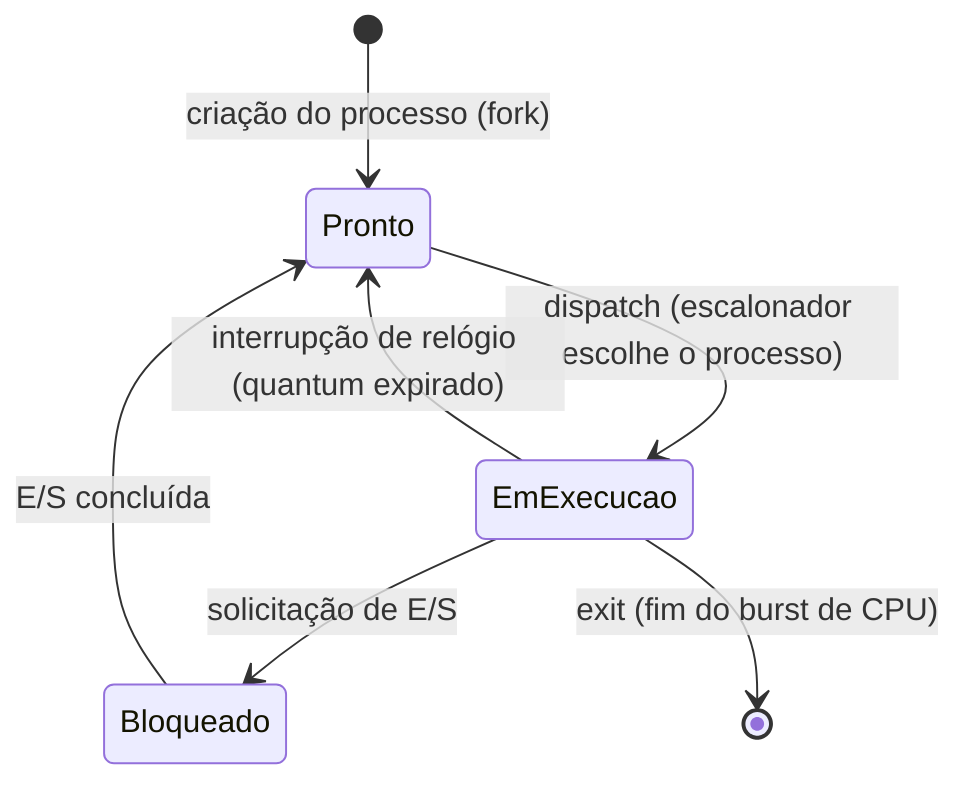

# Especificação de Projeto: Simulador de Gerenciador de Processos de um Sistema Operacional

**Disciplina:** Sistemas Operacionais

**Tema:** Gerenciamento de Processos e Threads (Capítulo 2)

**Modalidade:** Individual ou em equipe (máximo 3 componentes)

**Formato de entrega:** Documento Markdown (`.md`), publicado no repositório GitHub de cada componente da equipe

**Uso posterior:** Este documento servirá como especificação de entrada (harness) para geração de código via Claude Code / Open Code

**GRUPO:** Paulo Vinicius Holanda Gomes, Vinicius Silva Pereira
---

## Sumário

1. [Visão Geral e Arquitetura do Simulador](#1-visão-geral-e-arquitetura-do-simulador)
2. [Especificação do PCB e Tabela de Processos](#2-especificação-do-bloco-de-controle-de-processo-pcb-e-tabela-de-processos)
3. [Ciclo de Vida e Grafo de Transição de Estados](#3-ciclo-de-vida-e-grafo-de-transição-de-estados)
4. [Especificação do Escalonador de CPU](#4-especificação-do-escalonador-de-cpu)
5. [Entradas, Casos de Teste e Diretrizes de Entrega](#5-entradas-casos-de-teste-e-diretrizes-de-entrega)

---

## 1. Visão Geral e Arquitetura do Simulador

### 1.1 Contexto

O simulador é um programa executado inteiramente em **modo usuário**, cujo objetivo é reproduzir, de forma simplificada, o comportamento do núcleo (kernel) de um sistema operacional no que diz respeito ao gerenciamento de processos. Ele não interage com hardware real nem com o escalonador do SO hospedeiro: toda a "CPU", os "processos" e o "tempo" são entidades simuladas dentro do próprio programa.

O propósito do simulador é reproduzir os mecanismos centrais de gerenciamento de processos discutidos no Capítulo 2:
- Representação de processos via PCB;
- Transições entre estados;
- Escalonamento da CPU;
- Contabilização de tempo de CPU e tempo de espera.

### 1.2 Fluxo Geral de Execução

O simulador deve seguir o seguinte laço principal (*main loop*):

```
1. Carregar o arquivo de tarefas (workload) e criar os PCBs iniciais.
2. Enquanto houver processos não finalizados:
   a. O Escalonador seleciona o próximo processo a executar (dispatch).
   b. A CPU virtual "executa" o processo por um intervalo de tempo simulado
      (1 unidade de tempo por iteração, ou até o próximo evento relevante).
   c. Verificar eventos que podem ocorrer nessa unidade de tempo:
        - Expiração do quantum (interrupção de relógio);
        - Solicitação de E/S pelo processo em execução;
        - Término do burst de CPU (chamada exit);
        - Conclusão de operações de E/S de processos bloqueados.
   d. Atualizar o PCB do(s) processo(s) afetado(s) e realizar a(s)
      transição(ões) de estado correspondente(s).
   e. Registrar o evento no log de transições e no Gráfico de Gantt textual.
3. Ao término de todos os processos, calcular e exibir as estatísticas finais.
```

### 1.3 Estrutura Simplificada do Hardware Simulado

| Componente | Descrição |
|---|---|
| **CPU Virtual** | Unidade de execução única (simulador single-core na versão base; multi-core pode ser extensão opcional). |
| **Registradores Básicos** | Conjunto mínimo simulado (ex.: `AX`, `BX`, `PC`, `SP`) armazenado como parte do contexto do processo. Não precisam ter significado funcional real — servem para demonstrar o conceito de **troca de contexto**. |
| **Contador de Programa (PC)** | Valor inteiro que representa a "próxima instrução" fictícia do processo; incrementado a cada unidade de tempo de CPU consumida. |
| **Relógio Lógico (Clock)** | Contador global de unidades de tempo simuladas, incrementado a cada iteração do laço principal. É a base de tempo para quantum, tempos de espera e geração de interrupções periódicas. |
| **Interrupção de Relógio (Timer Interrupt)** | Evento gerado pelo simulador quando o tempo decorrido de execução contínua de um processo atinge o quantum definido pelo escalonador. |

### 1.4 Requisitos Gerais de Arquitetura

- O simulador deve ser implementado com separação clara entre:
  - **Núcleo de simulação** (clock, laço principal, fila de eventos);
  - **Tabela de processos e PCBs**;
  - **Módulo de escalonamento** (deve ser plugável — ver Seção 4);
  - **Módulo de E/S simulada**;
  - **Módulo de saída/relatórios** (Gantt textual, logs, estatísticas).
- Recomenda-se (mas não é obrigatório) o uso do padrão *Strategy* para tornar os algoritmos de escalonamento intercambiáveis em tempo de configuração.

---

## 2. Especificação do Bloco de Controle de Processo (PCB) e Tabela de Processos

### 2.1 Estrutura do PCB

Cada processo simulado deve ser representado por uma estrutura de dados (`struct`, `record`, `class`, conforme a linguagem escolhida) contendo, no mínimo, os campos abaixo:

| Campo | Tipo sugerido | Descrição |
|---|---|---|
| `pid` | inteiro | Identificador único do processo. |
| `estado` | enum | Estado atual: `PRONTO`, `EM_EXECUCAO`, `BLOQUEADO`. Ao sofrer `exit`, o processo é removido da tabela ativa e movido para a lista de terminados (ver Seção 2.2) — não é necessário um valor de enum próprio para isso. |
| `registradores_salvos` | struct | Cópia do contexto de CPU (PC, registradores) salva na última preempção/bloqueio. |
| `prioridade` | inteiro | Prioridade estática ou dinâmica (conforme algoritmo escolhido — Seção 4.2). |
| `tempo_chegada` | inteiro | Instante (em unidades de clock) em que o processo entrou no sistema. |
| `tempo_cpu_total` | inteiro | Duração total de CPU necessária para concluir o processo (burst total). |
| `tempo_cpu_executado` | inteiro | Quanto de CPU já foi consumido até o momento. |
| `tempo_espera_acumulado` | inteiro | Tempo total que o processo passou no estado `PRONTO` aguardando a CPU. |
| `tempo_bloqueado_restante` | inteiro | Quando em `BLOQUEADO`, quantas unidades de tempo faltam para a E/S concluir. |
| `lista_eventos_es` | fila | Sequência de eventos de E/S pendentes (burst de CPU seguido de burst de E/S), conforme o arquivo de tarefas. |
| `quantum_restante` | inteiro | (Apenas se Round Robin) Quanto do quantum atual ainda não foi consumido. |

### 2.2 Tabela de Processos

A Tabela de Processos é a estrutura central que mantém todos os PCBs do sistema simulado, organizada como:

- Um **mapa/dicionário** indexado por `pid` para acesso direto (ex.: ao registrar conclusão de E/S de um processo específico);
- Referências (ponteiros ou IDs) organizadas em **filas** específicas por estado:
  - Fila de **Prontos** (usada pelo escalonador);
  - Fila/lista de **Bloqueados** (aguardando E/S).
- Uma **lista de terminados**, fora da tabela ativa, apenas para fins de cálculo de estatísticas finais (não é um estado do ciclo de vida, e sim um registro histórico).

A especificação deve deixar explícito que a movimentação de um processo entre essas filas é **exatamente** o que caracteriza uma transição de estado (Seção 3).

### 2.3 Conteúdo Mínimo desta Seção

- Definição textual e/ou diagramática (ex.: diagrama de classes ou struct) do PCB completo.
- Justificativa de cada campo em relação aos conceitos do Capítulo 2 (ex.: por que salvar registradores é necessário para troca de contexto).
- Descrição de como a Tabela de Processos é organizada e como o PID é gerado e reutilizado (ou não).

---

## 3. Ciclo de Vida e Grafo de Transição de Estados

### 3.1 Estados Modelados

O simulador deve modelar, no mínimo, os três estados clássicos:

- **Pronto (Ready):** o processo está apto a executar e aguarda alocação de CPU pelo escalonador.
- **Em Execução (Running):** o processo está atualmente de posse da CPU.
- **Bloqueado (Blocked/Waiting):** o processo aguarda a conclusão de uma operação de E/S.

A criação do processo insere-o diretamente em `Pronto`, e a chamada `exit` o remove diretamente a partir de `Em Execução` — não há estados de `Novo` ou `Terminado` no ciclo de vida modelado; a criação e o término são tratados como transições de entrada/saída do sistema, não como estados propriamente ditos.

### 3.2 Grafo de Transições



### 3.3 Especificação das Transições

Cada transição deve ser especificada com, no mínimo:
- **Evento disparador**
- **Estado de origem → Estado de destino**
- **Ações executadas pelo simulador durante a transição** (ex.: salvar/restaurar contexto, atualizar contadores de tempo, reposicionar o processo na fila correta)

| # | Evento | Origem → Destino | Ações obrigatórias |
|---|---|---|---|
| 1 | Criação de processo (fork simulado) | *(entrada no sistema)* → `Pronto` | Alocar PCB, gerar PID, inicializar campos de tempo, inserir na fila de prontos. |
| 2 | Interrupção de relógio (quantum expirado) | `Em Execução` → `Pronto` | Salvar contexto (registradores, PC) no PCB; zerar/recarregar `quantum_restante`; reinserir no fim da fila de prontos (ou conforme a prioridade, no caso do algoritmo de prioridades). |
| 3 | Solicitação de E/S | `Em Execução` → `Bloqueado` | Salvar contexto; registrar duração da E/S (`tempo_bloqueado_restante`); mover para a fila de bloqueados. |
| 4 | E/S concluída | `Bloqueado` → `Pronto` | Zerar `tempo_bloqueado_restante`; mover para a fila de prontos; (opcional) aplicar bônus de prioridade para evitar inanição. |
| 5 | Término do processo (exit) | `Em Execução` → *(saída do sistema)* | Registrar tempo final; calcular métricas individuais (turnaround, espera); mover o PCB para a lista de terminados; remover o processo da tabela ativa. |

### 3.4 Conteúdo Mínimo desta Seção

- Diagrama de estados completo (o `mermaid` acima é um modelo mínimo aceitável, podendo ser detalhado além do exigido).
- Tabela de transições com evento, origem, destino e ações, como acima.
- Discussão textual de **quem** dispara cada transição (o simulador de clock, o próprio processo, ou o driver de E/S simulado).

---

## 4. Especificação do Escalonador de CPU

O simulador deve suportar **pelo menos dois algoritmos de escalonamento**, de forma **intercambiável** (selecionáveis por configuração, sem necessidade de recompilar toda a lógica do núcleo).

### 4.1 Escalonamento Circular (Round Robin)

- **Estrutura de dados:** fila circular (ou fila comum tratada como circular) contendo os processos no estado `Pronto`.
- **Parâmetro obrigatório:** `quantum` (unidades de tempo), configurável via arquivo de configuração ou arquivo de tarefas.
- **Regra de despacho:** o processo na cabeça da fila é despachado para execução; ao expirar o quantum (ou ao bloquear/terminar antes disso), o próximo da fila é despachado.
- **Regra de retorno à fila:** um processo preemptado por quantum expirado retorna ao **final** da fila de prontos.
- **Casos de borda a especificar:**
  - Processo cujo burst restante é menor que o quantum (deve terminar ou bloquear antes da expiração).
  - Empate entre processos que chegam no mesmo instante de tempo (ordem de desempate deve ser definida, ex.: ordem de PID).

### 4.2 Escalonamento por Prioridades (Estáticas ou Dinâmicas)

- **Estrutura de dados:** fila de prontos ordenada por prioridade (ex.: heap de prioridade, ou múltiplas filas por nível de prioridade — *multilevel queue*).
- **Modalidade estática:** prioridade definida na criação do processo e imutável.
- **Modalidade dinâmica (recomendada):** prioridade recalculada periodicamente com base em tempo de espera e/ou histórico de uso de CPU.
- **Mecanismo obrigatório de prevenção de inanição (starvation):** deve ser especificada e implementada pelo menos uma técnica, por exemplo:
  - **Aging:** incremento gradual da prioridade de um processo proporcional ao tempo que ele permanece na fila de prontos sem ser executado.
  - **Prioridade dinâmica por penalização de uso de CPU:** processos que consomem muita CPU recebem prioridade reduzida temporariamente, favorecendo processos que aguardam há mais tempo.
- **Regra de desempate:** processos de mesma prioridade devem ser tratados por outra política secundária (ex.: FCFS entre eles, ou Round Robin dentro do mesmo nível de prioridade).

### 4.3 Conteúdo Mínimo desta Seção

Para cada algoritmo, a especificação deve conter:
- Estrutura de dados utilizada para a fila de prontos;
- Pseudocódigo do laço de decisão do escalonador (função "quem executa agora?");
- Especificação de como a preempção ocorre (o quê é salvo/restaurado);
- Especificação do mecanismo anti-inanição, no caso de prioridades;
- Discussão comparativa breve: em que cenário cada algoritmo tende a ser mais justo/eficiente.

---

## 5. Entradas, Casos de Teste e Diretrizes de Entrega

### 5.1 Arquivo de Tarefas (Workload)

O simulador deve ler um **arquivo de tarefas** descrevendo os processos a simular. Sugestão de formato textual simples (uma linha por processo):

```
# pid  chegada  prioridade  sequencia_de_bursts (CPU,E/S,CPU,E/S,...)
1      0        3           5,3,4,2,6
2      2        1           2,4,3
3      2        5           8
```

Onde a sequência de *bursts* alterna CPU e E/S: por exemplo, `5,3,4,2,6` significa: executa 5 unidades de CPU, bloqueia por 3 unidades de E/S, executa 4 unidades de CPU, bloqueia por 2 unidades de E/S, executa 6 unidades de CPU e termina.

Devem ser especificados:
- O formato exato adotado (podem existir variações, desde que documentadas);
- Como o quantum (para Round Robin) e outros parâmetros de configuração são informados (arquivo separado, linha de comando, cabeçalho do próprio arquivo de tarefas etc.);
- Validações mínimas de entrada (ex.: PIDs duplicados, valores negativos).

### 5.2 Casos de Teste Obrigatórios

No mínimo, a especificação (e posteriormente a implementação) deve cobrir:

1. **Caso simples sem E/S:** poucos processos, apenas bursts de CPU, para validar o escalonamento puro.
2. **Caso com E/S intercalada:** processos que alternam CPU e E/S, validando as transições `Em Execução → Bloqueado → Pronto`.
3. **Caso de estresse para Round Robin:** quantum pequeno em relação aos bursts, gerando múltiplas preempções.
4. **Caso de estresse para Prioridades:** processo de baixa prioridade "por muito tempo" na fila, para validar o mecanismo anti-inanição.
5. **Caso de chegada não simultânea:** processos com `tempo_chegada` distintos, validando a admissão gradual no sistema.

### 5.3 Saída do Simulador

O simulador deve produzir, para cada execução:

- **Gráfico de Gantt textual**, no formato aproximado:
  ```
  |  P1  |  P2  |  P1  |  P3  |  P2  |
  0      4      6      10     13     16
  ```
- **Log de transições de estado**, uma linha por evento, contendo no mínimo: instante de tempo, PID, estado de origem, estado de destino, evento disparador.
- **Estatísticas finais**, incluindo, por processo e em média geral:
  - Tempo de turnaround (retorno);
  - Tempo de espera total;
  - Tempo de resposta (primeira vez que entra em execução);
  - Utilização da CPU (percentual do tempo total simulado em que a CPU esteve ocupada);
  - Número de trocas de contexto.

### 5.4 Diretrizes de Entrega

1. **Formação de equipe:** até 3 componentes por equipe.
2. **Formato do documento:** Markdown (`.md`), seguindo aproximadamente a estrutura das 5 seções deste documento.
3. **Publicação:** cada integrante da equipe deve publicar o documento de especificação em seu próprio repositório GitHub pessoal.
4. **Uso posterior do documento:** a especificação entregue servirá como entrada (prompt/harness) para geração assistida de código (ex.: Claude Code, Open Code), portanto deve ser suficientemente precisa e não ambígua para orientar a geração automática da implementação.
5. **Recomendação:** deixar explícitas todas as decisões de projeto que não estejam determinadas pelo enunciado (ex.: linguagem de implementação, formato exato do arquivo de tarefas, critério de desempate), já que essas decisões impactam diretamente a qualidade do código gerado a partir do documento.
